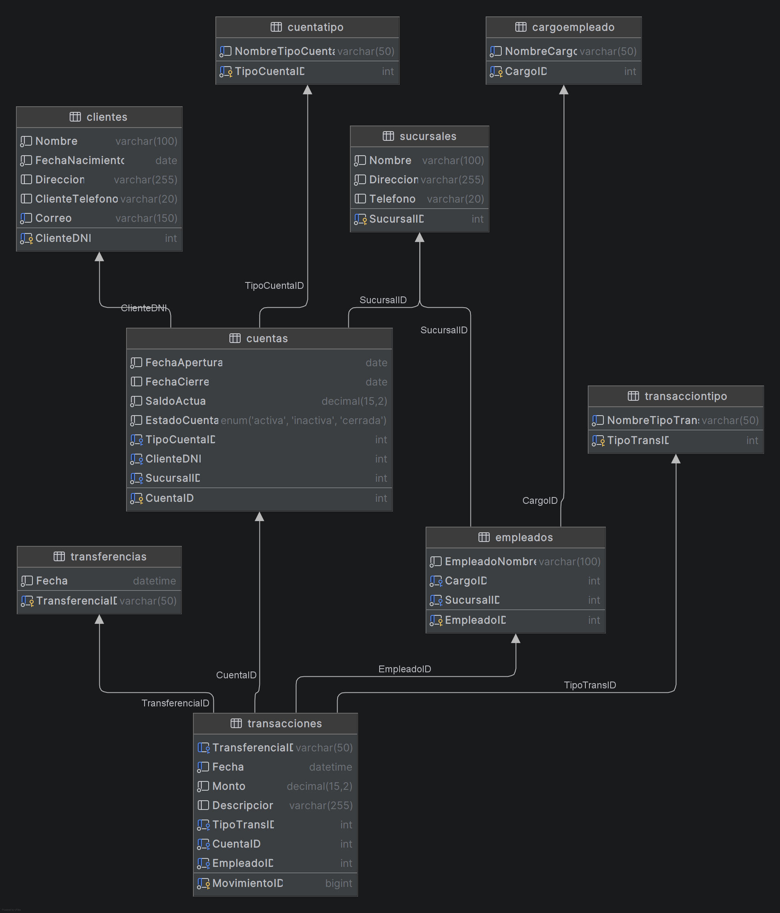

# Documentación Técnica - Sistema Bancario (BancoDB)

## 1. Introducción
Este documento detalla la estructura y el diseño de la base de datos `BancoDB`, desarrollada para gestionar las transacciones y operaciones de un sistema bancario. Se expone el modelo relacional, el proceso de normalización aplicado para asegurar la integridad de los datos, así como la configuración de roles, privilegios y estrategias de respaldo.

## 2. Proceso de Normalización y Justificación de Diseño
La base de datos original (proveniente de archivos crudos como CSVs) presentaba redundancias y posibles anomalías de inserción y actualización. El diseño fue llevado hasta la Tercera Forma Normal (3FN).

### 2.1 Primera Forma Normal (1FN)
- **Regla aplicada**: Todos los atributos deben ser atómicos y no deben existir grupos repetitivos.
- **Justificación y Diseño**: Se modelaron las entidades `Clientes`, `Empleados` y `Sucursales` garantizando atributos indivisibles (p. ej., asegurando direcciones en un campo y teléfonos en otro independiente). En los movimientos, la tabla `Transacciones` se atomizó para que cada fila represente un único flujo.

### 2.2 Segunda Forma Normal (2FN)
- **Regla aplicada**: Debe cumplir la 1FN y todos los atributos no clave deben depender completamente de la clave primaria.
- **Justificación y Diseño**: Las propiedades de un `Empleado` no dependen de la `Sucursal`, sino únicamente de su DNI/ID. En el diseño, se separó la información tabular de Sucursales, ligándolos exclusivamente por claves foráneas. Asimismo, las `Transferencias` se separaron de los movimientos individuales de `Transacciones`, ya que los detalles de tiempo u origen de transferencia estaban parcialmente desligados del movimiento singular de cuenta.

### 2.3 Tercera Forma Normal (3FN)
- **Regla aplicada**: Debe cumplir la 2FN y los atributos no clave no deben depender de otros atributos no clave (cero dependencias transitivas).
- **Justificación y Diseño**: En base a los datos, los roles de los empleados y los tipos de cuenta se repetían constantemente en formato texto ("Ahorro", "Corriente"). Se extrajeron en tablas catálogo independientes: `CuentaTipo`, `CargoEmpleado` y `TransaccionTipo`. Ahora, las tablas principales (como Cuentas o Transacciones) dependen unívocamente del ID transitorio mediante relaciones.

## 3. Modelo Relacional y Diagrama ER

A continuación se presenta el Modelo Entidad-Relación de la base de datos:

> 

## 4. Diccionario de Datos

El siguiente apartado describe la metainformación de cada tabla en la base de datos `BancoDB`.

> DICCIONARIO DE DATOS

| Tabla | Campo | Tipo de Dato | Llave | Extra | Descripción |
| :--- | :--- | :--- | :--- | :--- | :--- |
| cargoempleado | CargoID | int | PRI | auto\_increment |  |
| cargoempleado | NombreCargo | varchar\(50\) | UNI |  |  |
| clientes | ClienteDNI | int | PRI |  | Documento Nacional de Identidad del cliente \(Llave Primaria\) |
| clientes | ClienteTelefono | varchar\(20\) |  |  |  |
| clientes | Correo | varchar\(150\) | UNI |  | Correo electrónico único del cliente |
| clientes | Direccion | varchar\(255\) |  |  |  |
| clientes | FechaNacimiento | date |  |  |  |
| clientes | Nombre | varchar\(100\) |  |  |  |
| cuentas | ClienteDNI | int | MUL |  |  |
| cuentas | CuentaID | int | PRI |  |  |
| cuentas | EstadoCuenta | enum\('ACTIVA','INACTIVA','CERRADA'\) |  |  | Estado de vigencia de la cuenta. |
| cuentas | FechaApertura | date |  |  |  |
| cuentas | FechaCierre | date |  |  |  |
| cuentas | SaldoActual | decimal\(15,2\) |  |  | Saldo disponible actual en la cuenta, validado para no ser negativo. |
| cuentas | SucursalID | int | MUL |  |  |
| cuentas | TipoCuentaID | int | MUL |  |  |
| cuentatipo | NombreTipoCuenta | varchar\(50\) | UNI |  |  |
| cuentatipo | TipoCuentaID | int | PRI | auto\_increment |  |
| empleados | CargoID | int | MUL |  |  |
| empleados | EmpleadoID | int | PRI |  |  |
| empleados | EmpleadoNombre | varchar\(100\) |  |  |  |
| empleados | SucursalID | int | MUL |  |  |
| sucursales | Direccion | varchar\(255\) |  |  |  |
| sucursales | Nombre | varchar\(100\) |  |  |  |
| sucursales | SucursalID | int | PRI |  |  |
| sucursales | Telefono | varchar\(20\) |  |  |  |
| transacciones | CuentaID | int | MUL |  |  |
| transacciones | Descripcion | varchar\(255\) |  |  |  |
| transacciones | EmpleadoID | int | MUL |  |  |
| transacciones | Fecha | datetime | MUL |  |  |
| transacciones | Monto | decimal\(15,2\) |  |  | Cantidad monetaria operada en la transacción \(Mayor a 0\) |
| transacciones | MovimientoID | bigint | PRI |  | ID del movimiento \(Llave Primaria\) |
| transacciones | TipoTransID | int | MUL |  |  |
| transacciones | TransferenciaID | varchar\(50\) | MUL |  |  |
| transacciontipo | NombreTipoTrans | varchar\(50\) | UNI |  |  |
| transacciontipo | TipoTransID | int | PRI | auto\_increment |  |
| transferencias | Fecha | datetime |  |  |  |
| transferencias | TransferenciaID | varchar\(50\) | PRI |  |  |

## 5. Roles y Privilegios
Se establecieron tres roles principales para el manejo de los procedimientos almacenados, protegiendo así la manipulación de datos sensibles:

- **Admin**: Acceso total al DDL, DML y todos los procedimientos. Capacidad de administrar roles y gestionar los respaldos.
- **Gerente**: Privilegios de ejecución sobre procedimientos de reporte, apertura/cierre de cuentas, y creación de clientes (`SP_ReporteClientesSucursal`, `SP_ReporteMovimientosCuenta`, `SP_AbrirCuenta`, `SP_CerrarCuenta`, `SP_RegistrarCliente`, `SP_ActualizarCliente`).
- **Cajero**: Privilegios de ejecución sobre operaciones diarias de transacciones (`SP_RegistrarDeposito`, `SP_RealizarTransferencia`, `SP_RegistrarRetiro`).

## 6. Estrategia de Respaldos (Seguridad)
Se implementa una política de copias de seguridad de recuperación completa conformada por:

1. **Respaldo Completo**: Respalda el modelo de base de datos con tablas, vistas e índices, junto con sus datos, pero **sin incluir procedimientos almacenados**.
2. **Respaldos Incrementales (3)**: Cada incremento respalda exclusivamente un lote de tres procedimientos almacenados. 
   - *Incremental 1*: SP_AbrirCuenta, SP_RegistrarDeposito, SP_RealizarTransferencia.
   - *Incremental 2*: SP_ReporteClientesSucursal, SP_CerrarCuenta, SP_RegistrarRetiro.
   - *Incremental 3*: SP_RegistrarCliente, SP_ActualizarCliente, SP_ReporteMovimientosCuenta.

Esta estructura modular asegura que las rutinas lógicas sean inyectadas en pasos, permitiendo observar y controlar posibles brechas.

## 7. Explicación de los Procedimientos Almacenados
La base de datos delega directamente sus transacciones de negocio al motor SQL mediante 9 procedimientos almacenados. Estos aseguran la correcta integración lógica bajo las propiedades ACID, con protección de los saldos e históricos:

1. **SP_AbrirCuenta**: Verifica que el saldo inicial no sea menor a cero (`IF SaldoInicial < 0 THEN ROLLBACK`). Tras validar, hace un `INSERT INTO Cuentas` enlazando DNI, sucursal y tipo de cuenta.
2. **SP_RegistrarDeposito**: Ejecuta una transacción (`START TRANSACTION`). Hace un `INSERT INTO Transacciones` validando el tipo y después lanza un `UPDATE Cuentas` para sumar el `Monto` al `SaldoActual`.
3. **SP_RealizarTransferencia**: El bloque transaccional más sensible. Chequea que el origen cuente con saldo (`SaldoActual >= Monto`). Si es válido, inserta la transferencia padre, y luego registra dos movimientos opuestos en `Transacciones`. Con finalización afectando a Cuentas en paralelo (Resta a una, suma a otra).
4. **SP_ReporteClientesSucursal**: Generación de reportes limpios (lectura `SELECT`) operando múltiples `INNER JOIN` para amarrar la `SucursalID` e imprimiendo la data.
5. **SP_CerrarCuenta**: Validación condicional obligatoria (`IF SaldoActual = 0`). Si el remanente está despejado, somete la tupla a estado `INACTIVA` y guarda registro estático con `UPDATE Cuentas`.
6. **SP_RegistrarRetiro**: Lógica transaccional a la inversa del depósito. Su restricción vital es comprobar `SaldoActual >= Monto` de lo contrario arroja una excepción sin ejecutar el commit final.
7. **SP_RegistrarCliente**: Bloque DML de tipo inserción `INSERT`. Atrapa errores si la llave de DNI ya existe (`UNIQUE constraint`).
8. **SP_ActualizarCliente**: Uso de DML con la sintaxis `UPDATE Clientes SET ... WHERE ClienteDNI = x`. 
9. **SP_ReporteMovimientosCuenta**: Realiza agrupaciones (Data Query Language, `SELECT`) con condicionantes temporales vinculados (`WHERE Fecha BETWEEN x AND y`) para el corte de cuenta exigido.