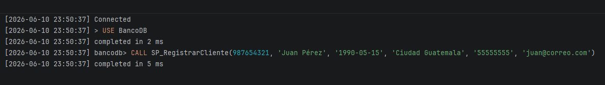
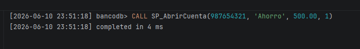
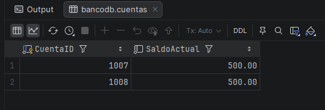

# Manual de Usuario - Sistema Bancario

## 1. Introducción
Este manual proporciona una guía paso a paso para utilizar el sistema bancario `BancoDB`. Incluye los detalles para probar los 9 procedimientos almacenados obligatorios y las instrucciones para realizar procesos de recuperación de la base de datos mediante respaldos.

## 2. Guía de Procedimientos Almacenados (Flujo de Uso)

A continuación, se detalla el flujo lógico de uso del sistema. Usted puede ejecutar estas sentencias consecutivamente para probar todas las operaciones bancarias.

### 2.1 SP_RegistrarCliente (Paso 1)
- **Descripción**: Ingresa al sistema un nuevo cliente.
- **Uso / Parámetros**: `CALL SP_RegistrarCliente(ClienteDNI, Nombre, FechaNacimiento, Direccion, Telefono, Correo);`
- **Resultado esperado**: Agrega el nuevo ente al catálogo.
- **Ejemplo a ejecutar**:
  ```sql
  CALL SP_RegistrarCliente(987654321, 'Juan Pérez', '1990-05-15', 'Ciudad', '55555555', 'juan@correo.com');
  ```
- **Captura de Ejecución**:
  > *[CAPTURA: Ejecución exitosa de creación de cliente]*
  > 

### 2.2 SP_AbrirCuenta (Paso 2)
- **Descripción**: Registra una nueva cuenta para el cliente que acabamos de crear.
- **Uso / Parámetros**: `CALL SP_AbrirCuenta(ClienteDNI, TipoCuenta, SaldoInicial, SucursalID);`
- **Resultado esperado**: Se crea en el sistema la cuenta y su estado es 'ACTIVA'. (Revise el ID generado con `SELECT * FROM Cuentas;` para los siguientes pasos, usualmente es el último o el ID 1).
- **Ejemplo a ejecutar**:
  ```sql
  CALL SP_AbrirCuenta(987654321, 'Ahorro', 500.00, 1);
  ```
- **Captura de Ejecución**:
  > *[CAPTURA: Ejecución exitosa de apertura de cuenta]*
  > 

### 2.3 SP_RegistrarDeposito (Paso 3)
- **Descripción**: Ingresa dinero a la cuenta actualizando su saldo y registrando la transacción.
- **Uso / Parámetros**: `CALL SP_RegistrarDeposito(CuentaID, Monto, Descripcion, EmpleadoID);`
- **Resultado esperado**: El saldo total del cliente aumenta según el monto otorgado. 
- **Ejemplo a ejecutar (Suponiendo CuentaID = 1)**:
  ```sql
  CALL SP_RegistrarDeposito(1, 150.00, 'Depósito en efectivo', 101);
  ```
- **Captura de Ejecución**:
  > *[CAPTURA: Muestra consola arrojando que el depósito fue exitoso]*
  > 

### 2.4 SP_RegistrarRetiro (Paso 4)
- **Descripción**: Resta el dinero de una cuenta válida, cuidando que exista el saldo.
- **Uso / Parámetros**: `CALL SP_RegistrarRetiro(CuentaID, Monto, Descripcion, EmpleadoID);`
- **Resultado esperado**: El dinero disminuye.
- **Ejemplo a ejecutar**:
  ```sql
  CALL SP_RegistrarRetiro(1, 50.00, 'Retiro de cajero', 101);
  ```
- **Captura de Ejecución**:
  > *[CAPTURA: Mostrando el retiro concretándose sin error]*
  > 

### 2.5 SP_RealizarTransferencia (Paso 5)
- **Descripción**: Mueve fondos de una cuenta a otra, manejando control de errores (rollback).
- **Uso / Parámetros**: `CALL SP_RealizarTransferencia(CuentaOrigenID, CuentaDestinoID, Monto);`
- **Resultado esperado**: A la cuenta origen se le descuentan los fondos y a la destino se le aumentan. *(Requiere tener al menos dos cuentas creadas)*.
- **Ejemplo a ejecutar**:
  ```sql
  CALL SP_RealizarTransferencia(1, 2, 200.00);
  ```
- **Captura de Ejecución**:
  > *[CAPTURA: Realiza el llamado al procedimiento y pantallazo al éxito de transferencia]*
  > 

### 2.6 SP_ReporteClientesSucursal (Paso 6)
- **Descripción**: Muestra un listado de clientes por nombre de sucursal.
- **Uso / Parámetros**: `CALL SP_ReporteClientesSucursal(NombreSucursal);`
- **Resultado esperado**: Una vista tabular limpia que expone únicamente los requeridos.
- **Ejemplo a ejecutar**:
  ```sql
  CALL SP_ReporteClientesSucursal('Sucursal Central');
  ```
- **Captura de Ejecución**:
  > *[CAPTURA: GRID / TABLA DE RESULTADO con las filias coincidentes]*
  > 

### 2.7 SP_ActualizarCliente (Paso 7)
- **Descripción**: Actualiza campos de contacto en un registro de cliente ya existente.
- **Uso / Parámetros**: `CALL SP_ActualizarCliente(ClienteDNI, Direccion, Telefono, Correo);`
- **Resultado esperado**: Modifica dirección y teléfono.
- **Ejemplo a ejecutar**:
  ```sql
  CALL SP_ActualizarCliente(987654321, 'Nueva Dirección', '66666666', 'jperez@correo.com');
  ```
- **Captura de Ejecución**:
  > *[CAPTURA: Update de un cliente confirmado]*
  > 

### 2.8 SP_ReporteMovimientosCuenta (Paso 8)
- **Descripción**: Recupera el historial completo de movimientos para una cuenta en un marco de tiempo.
- **Uso / Parámetros**: `CALL SP_ReporteMovimientosCuenta(CuentaID, FechaInicio, FechaFin);`
- **Resultado esperado**: Devuelve el grid con los movimientos (incluyendo depósitos, retiros y transferencias previas).
- **Ejemplo a ejecutar**:
  ```sql
  CALL SP_ReporteMovimientosCuenta(1, '2026-06-01', '2026-06-30');
  ```
- **Captura de Ejecución**:
  > *[CAPTURA: GRID de la tabla de resultado obteniendo el historial]*
  > 

### 2.9 SP_CerrarCuenta (Paso 9)
- **Descripción**: Desactiva o cierra una cuenta. Exige que el saldo sea 0 para proceder.
- **Uso / Parámetros**: `CALL SP_CerrarCuenta(CuentaID);`
- **Resultado esperado**: El estado de cuenta cambia a "CERRADA". *(Si esta cuenta probada aún tiene dinero tras las transferencias, realice retiros de prueba hasta llegar a Q0.00 antes de correr esto).*
- **Ejemplo a ejecutar**:
  ```sql
  CALL SP_CerrarCuenta(1);
  ```
- **Captura de Ejecución**:
  > *[CAPTURA: Éxito de la consulta cambiando a cerrada]*
  > 

---

## 3. Guía Paso a Paso para la Ejecución del Proyecto (Despliegue y Recuperación)

### 3.1 Prerrequisitos e Instalación
1. Instalar las dependencias de Python necesarias abriendo una terminal:
   ```bash
   pip check
   pip install python-dotenv sqlalchemy pymysql
   ```
2. Asegurarse de tener instalado y configurado `mysqldump` en las variables de entorno de su sistema operativo (comprobar con el comando `mysqldump --version`).
3. Clonar o cambiar el nombre del archivo `.env.example` dejándolo como `.env` y configurar ahí las variables y credenciales de acceso a MySQL.
Para solventar errores de colisión por procedimientos existentes u olvido de contexto, recomendamos cargar todo usando un script consolidado que incluya encabezados de borrado:

1. Ejecutar **`1_database.sql`** (crea la estructura de tablas base).
2. Ejecutar de ser posible el archivo que contenga todo consolidado, anteponiendo explícitamente:
   ```sql
   USE BancoDB;
   DROP PROCEDURE IF EXISTS ... -- (Limpiar TODOS los existentes primeros)
   ```
   *Si se usan los archivos incrementales individuales (`2_incremental...`), asegúrese de rodearlos igual con el `USE BancoDB;`.*
3. Ejecutar **`4_users.sql`** para crear los roles e impartir los GRANTs.

> *[CAPTURA: Navegador de tu IDE (DataGrip/Workbench) con todas las 9 tablas y 9 procedimientos

> *[TOMA UNA CAPTURA AQUÍ: Una captura de pantalla donde se logre ver el navegador de tu IDE (DataGrip/Workbench) con todas las tablas y procedimientos ya listados]*
> 

### 3.3 Migración y Limpieza de Datos (Python)
Para realizar el ETL desde los archivos CSV, diríjase a la carpeta `/python` en terminal y ejecute:
1. `python reset.py`: Limpia la base de datos eliminando registros anteriores si los hubiera.
2. `python run.py`: Orquesta y ejecuta la migración masiva de datos en el orden apropiado (sucursales, clientes, empleados, cuentas, etc.) asegurando la integridad referencial de las llaves foráneas.

> *[TOMA UNA CAPTURA AQUÍ: Evidencia tu consola bash o VS Code corriendo `python run.py` donde se vea el output de éxito]*
> 

### 3.4 Creación de Respaldos (Backups)
Para la estrategia de seguridad, en la raíz del proyecto se incluye el script de volcado:
- Ejecutar mediante la terminal:
  ```bash
  python full_backup.py
  ```
- Este comando creará la carpeta `/backups` y generará un respaldo completo (ej. `respaldo_comp_[fecha].sql`). Está diseñado para hacer respaldo "full" de estructuras y tablas limpias, dejando por aparte los procedimientos que se recuperan mediante los archivos incrementales.
- Si se desea automatizar, puede añadirse a las Tareas Programadas de Windows (Task Scheduler).

> *[TOMA UNA CAPTURA AQUÍ: Captura donde se demuestre el archivo `.sql` de backup ya volcado e importado dentro de la carpeta /backups]*
> 

### 3.5 Pruebas Computacionales ACID (Pruebas de Concurrencia)
Para las validaciones de concurrencia y prevención de anomalías, en la carpeta `/tests_acid` se incluyen tests listos para ejecutarse:
- `python test_deadlock.py`: Prueba cómo responde el sistema ante bloqueos mutuos simulando dos cuentas.
- `python test_transferenciaConcurrente.py`: Simula transacciones ejecutándose en paralelo.

> *[TOMA UNA CAPTURA AQUÍ: Ejecución de `test_transferenciaConcurrente.py` logeando éxito u manejo de error de forma paralela en la consola]*
> 

---

## 4. Resolución de Problemas Comunes (Troubleshooting)

| **Problema** | **Causa Probable** | **Solución** |
| :--- | :--- | :--- |
| **Error (Access Denied / Acceso denegado) al correr scripts de Python** | El usuario o contraseña mapeados en `.env` son incorrectos, o no hiciste copia de `.env.example`. | Entra a la carpeta del proyecto, crea tu archivo `.env` rellenándolo con el user (generalmente root) de tu motor MySQL junto a su clave. Prueba nuevamente. |
| **Error (Data Truncated) / Fallan las fechas al insertar CSV** | Las fechas de Python al motor no compaginaron debido al locale. | Puedes ejecutar individualmente el archivo de `python reset.py` para limpiar la base. Luego, revisa el archivo de los clientes CSV o asegúrate que el script transforme el delimitador "YY-MM-DD" correctamente. |
| **MySQL devuelve error que no existe PROCEDURE al intentar hacer un depósito / transferencia** | Omitiste paso 2 de la instalación base. No corriste los respaldos incrementales de procedimientos. | Ubícate en `/sql/` y manda a ejecutar (`source` en CMD, o Play en DataGrip) a los archivos `2_incremental_1.sql` / 2 / 3. Luego intenta usar el SP nuevamente. |
| **mysqldump: command not found al efectuar `python full_backup.py`** | Las Variables de Entorno globales de tu PC no conocen dónde reside el binario de MySQL. | Ve a Editar las variables de entorno de sistema (en Windows) -> Path. Añade ahí la dirección física donde está la carpeta de instalación base de MySQL Server, específicamente hasta la carpeta `\bin`. Guarda, reinicia tu terminal y ejecuta de nuevo. |
| **Transferencias arrojan ROLLBACK intencionalmente** | Se intentó hacer una transferencia por Q300 en una cuenta que solo tenía Q150, o el DNI origen no existe. | Verifica tus datos haciendo unas lecturas `SELECT` directas sobre la cuenta o intentando montos a tono al Saldo, los procedimientos bloquean la trampa a propósito para resguardar saldos íntegros. |